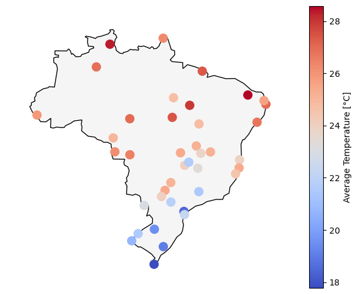

# Data Visualization

Module: DS_Data_Visualization_2023

Degree: Master Digital Science 

Name: Finn Heydemann

Lecturer: Prof. Dr. Konrad Förstner
 

In this project, the surface climate in Brazil is visualized using the dataset available on Kaggle [Climate Weather Surface of Brazil - Hourly](https://www.kaggle.com/datasets/PROPPG-PPG/hourly-weather-surface-brazil-southeast-region). For this purpose, eight weather stations from each of the five regions (Central West, North, Northeast, South, Southeast) that are evenly spreaded across the country are selected and their data visualized.

## Temperature Visualization

It can be seen that the average temperature is higher in the areas near the equator (north).

Upon closer inspection, it can be seen that most of the difference comes from the winter months when the temperature drops significantly in the southern parts of the country. As an example, temperature boxplots from 4 stations in 2019 are shown.

The influence of global warming can be identified on the basis of individual weather stations (for example A922). For this purpose, the temperature is smoothed using a moving average filter and the respective maxima and minima are marked.

## Precipitation Visualization

In the analysis of precipitation, it can be seen that less precipitation falls in the central regions than in the northern and southern regions.

By drawing up a cumulative precipitation diagram, it can be seen that in the northern regions the precipitation is very intense from May. In the more central regions, on the other hand, there is less precipitation and this also rather during the early and late months of the year.

Please see the Jupyter Notebook for further plots and insights. 

